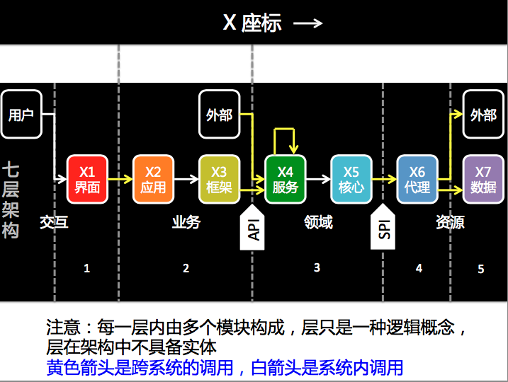
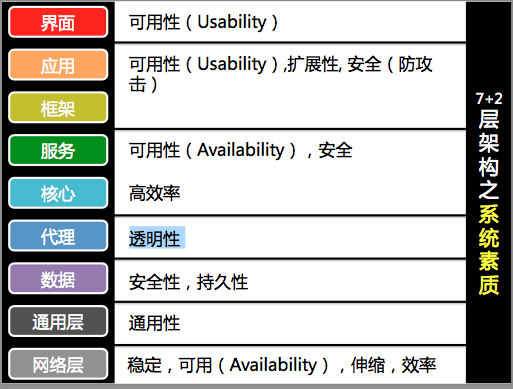
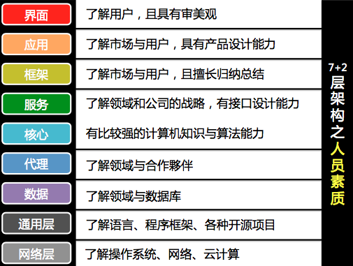
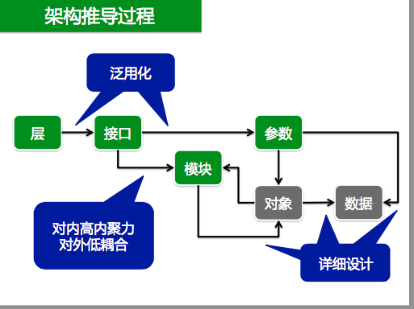
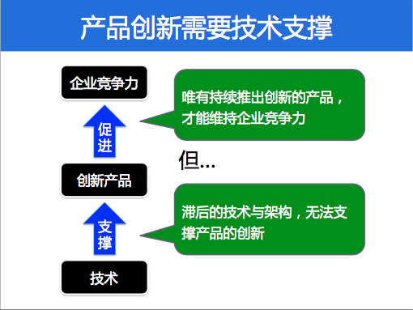
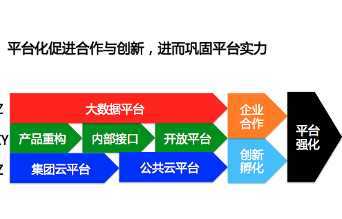

# 蔡学镛的软件架构设计方法论
2014年

【问题】要如何规划设计模块，并组织这些模块，使其成为「好的架构」，满足大格局的目标?   
【答案】第一步是切割出足够细粒度的模块，用正确的方法连结起来。 ****

### X坐标轴

核心层反映出「领域模型」   核心层的接口基本就是对此领域模型进行操作 


### 领域模型
为何要建立领域模型? 

1.  帮助接口设计 
2.  帮助数据存储设计，梳理出更具有弹性的存储方式 

服务层针对「领域对象」进行操作，并提供弹性的调用接口   
服务层接口通常数目不多，但每个接口通常参数相当多   
服务层没有状态，也不做缓存   实现 API。
如果公开，就是开放接口   
调用服务层的接口，通常需要授权 

### SPI
SPI的作用：

* 隔离:避免依赖特定的外部系统或数据库 

### 框架
将常用的应用流程设计成框架，后续开发「同类型应用」时， 只要通过参数或者 DSL，就可以轻易订制应用，减少开发应 用的成本 

### 7+2层架构之系统素质

### 7+2层架构之人员素质

### 架构设计过程

### 产品创新需要技术支撑

