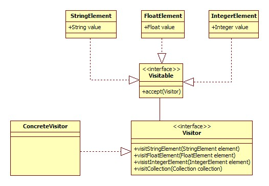
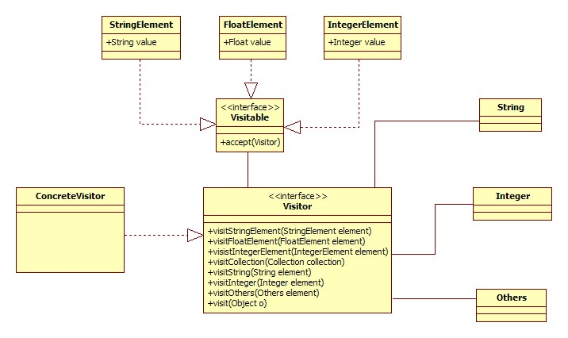

# Visitor模式
[原文地址：JAVA设计模式之Visitor模式]（http://blog.csdn.net/chenjie19891104/article/details/6393770）


一个集合（Collection）中，可以包含一个Car，也可以包含一个Cat，对于不同类型的元素，他们的行为也不尽相同，比如，Car可能有start()行为，而Cat可能有eat()的行为。可是对于Collection来说，不管你是Car，还是Cat，取出来的都是Object，那么我们如何知道取出来的是什么呢？
我们可能会如下操作：

```
Iterator itor = collection.iterator();
while(itor.hasNext()){
     Object o = itor.next();
     if(o instanceof Car){
          ((Car)o).start();
     }else if(o instanceof Cat){
          ((Cat)o).eat();
     }
}
``` 

这是你应该可以看出这种方式可能会出现的问题，假如现在Collection中放入了成千上万个不同类型的对象，也就意味着你需要成千上万个if else。这时，我们是否需要考量一下，我们的设计。。。
 
Yes！Visitor设计模式，就可以很好地解决这个问题。
 
Visitor设计模式，可以将一个集合中的元素和对各个元素的操作（行为）进行分离。首先我们看看Visitor设计模式中需要哪些组件来完成这个分离操作，如下图所示：




可见，Visitor模式中，集合中所有的元素必须实现Visitable接口，Visitable接口中声明了唯一的方法，这个方法注入Visitor对象，而Visitor接口是整个Visitor模式的核心组件，因为他包含了所有实现了Visitable接口的元素的行为，这样，当每个元素在accept()方法中就可以使用Visitor接口中自己需要的方法了。
但是，我们也看到，Visitor模式中，集合中的每种元素必需要实现Visitable接口来注入Visitor对象，这样Visitable相当于限定了集合中的各种对象，必须要实现Visitable接口。对于像String，Float等原有类型，则我们需要对其进行重新封装，实现Visitable接口，这样，无疑增加了代码容量。
还有一点，Visitor模式将所有的行为都放在Visitor中，这样破坏了类的封装性，不太符合开闭原则。（Visitor模式缺点）。所以，使用Visitor模式的时候，应当慎重权衡。
 
当然，可以采用Java反射技术来让Visitor模式变得更加灵活，使用反射技术后，集合中的元素将不再拘泥于实现了Visitable接口的类型，而可以是任意类型。使用了java反射技术后的组件模型如下图，




使用了反射技术后，在Visitor中我们多了一个visit(Object o)方法，该方法就是使用反射的技术来动态决定当前被访问的对象。
但是该方法则要求Visitor中所有对元素操作的方法按照规定来命名，该方法实现如下：

```

public void visit(Object o) {  
    String className = o.getClass().getName(); //获取类名称，这里是包含包名的全称  
    String methodName = "visit"+className.substring(className.lastIndexOf(".")+1);//组合获取方法名称  
    try {  
        //根据方法名从该类中获取相应的方法  
        Method m = this.getClass().getMethod(methodName, new Class[]{o.getClass()});  
        m.invoke(this, new Object[]{o});  
    } catch (NoSuchMethodException e) {  
        defaultVisit(o);  
    } catch (InvocationTargetException e) {  
        e.printStackTrace();  
    } catch (IllegalAccessException e) {  
        e.printStackTrace();  
    }  
}  


```


