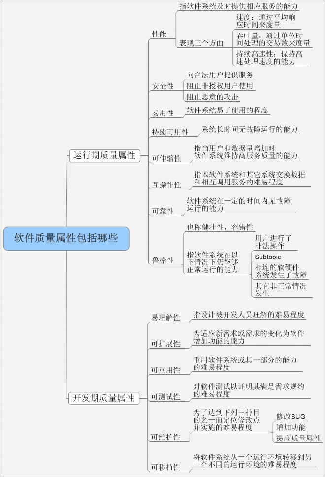
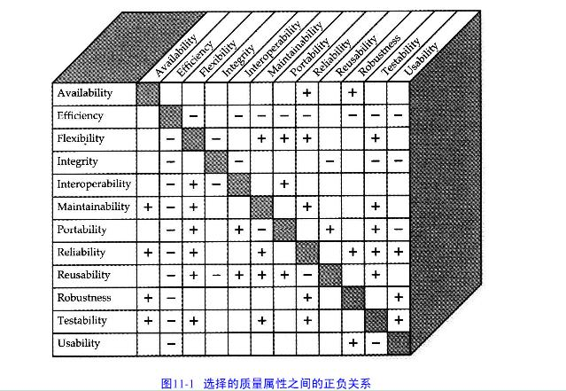

# 软件质量属性

|软件质量属性对用户最重要的属性  |对开发者最重要的属性|
| --- | --- |
|有效性（a v a i l a b i l i t y）  |可维护性( m a i n t a i n a b i l i t y )    |
|高效性( e fficiency)   |可移植性( p o r t a b i l i t y )|
| 灵活性( f l e x i b i l i t y )  |可重用性( r e u s a b i l i t y )|
|完整性(integrity)  |可测试性( t e s t a b i l i t y )|
|互操作性( i n t e r o p e r a b i l i t y )||
|可靠性( r e l i a b i l i t y )||
|健壮性( r o b u s t n e s s )||
|可用性( u s a b i l i t||

* 有效性：有效性指的是在预定的启动时间中，系统真正可用并且完全运行时间所占的百分比。更正式地说，有效性等于系统的平均故障时间（M T T F）除以平均故障时间与故障修复时间之和。一个有效性需求可能这样说明：“工作日期间，在当地时间早上6点到午夜，系统的有效性至少达到9 9 . 5 %，在下午4点到6点，系统的有效性至少可达到9 9 . 9 5 %“
* 高效性:效率是用来衡量系统如何优化处理器、磁盘空间或通信带宽的。你可以这样定义：“在预计的高峰负载条件下，1 0 %处理器能力和1 5 %系统可用内存必须留出备用。”在定义性能、能力和效率目标时，考虑硬件的最小配置是很重要的.
* 灵活性：灵活性表明了在产品中增加新功能时所需工作量的大小。灵活性目标是如下设定的：“一个至少具有6个月产品支持经验的软件维护程序员可以在一个小时之内为系统添加一个新的可支持硬拷贝的输出设备。
* 完整性（或安全性）：主要涉及：防止非法访问系统功能、防止数据丢失、防止病毒入侵并防止私人数据进入系统。用明确的术语陈述完整性的需求，如身份验证、用户特权级别、访问约束或者需要保护的精确数据。一个完整性的需求样本可以这样描述：“只有拥有查账员访问特权的用户才可以查看客户交易历史。
* 互操作性：互操作性表明了产品与其它系统交换数据和服务的难易程度。
互操作性需求：“化学制品跟踪系统应该能够从C h e m i D r a w和C h e m - S t r u c t工具中导入任何有效化学制品结构图。
* 可靠性：可靠性是软件无故障执行一段时间的概率（Musa, Iannino and Okumoto 1987）。健壮性和有效性有时可看成是可靠性的一部分。对于该系统的一个可靠性需求说明如下：“由于软件失效引起实验失败的概率应不超过5‰”
* 健壮性：健壮性指的是当系统或其组成部分遇到非法输入数据、相关软件或硬件组成部分的缺陷或异常的操作情况时，能继续正确运行功能的程度。我们的一个健壮性需求是这样说明的：“所有的规划参数都要指定一个缺省值，当输入数据丢失或无效时，就使用缺省值数据。”
* 可用性：可用性也称为“易用性”和“人类工程”，它所描述的是许多组成“用户友好”的因素。“一个培训过的用户应该可以在平均3分钟或最多5分钟时间以内，完成从供应商目录表中请求一种化学制品的操作“；“一个新用户用不到3 0分钟时间适应环境后，就应该可以对一个化学制品提出请求”，或者“新的操作员在一天的培训学习之后，就应该可以正确执行他们所要求的任务的9 5 %”
* 可维护性：可维护性表明了在软件中纠正一个缺陷或做一次更改的简易程度。可维护性需求：“在接到来自联邦政府修订的化学制品报告的规定后，对于现有报表的更改操作必须在一周内完成。”函数调用不能超过两层深度““每一个软件模块中，注释与源代码语句的比例至少为1∶2。”
* 可移植性：可移植性是度量把一个软件从一种运行环境转移到另一种运行环境中所花费的工作量。开发者就能选择设计和编码方法以适当提高产品的可移植性
可重用性：从软件开发的长远目标上看，可重用性表明了一个软件组件除了在最初开发的系统中使用之外，还可以在其它应用程序中使用的程度。确定新系统中哪些元素需要用方便于代码重用的方法设计，或者规定作为项目副产品的可重用性组件库
* 可测试性：可测试性指的是测试软件组件或集成产品时查找缺陷的简易程度。

