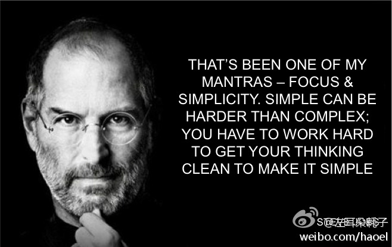
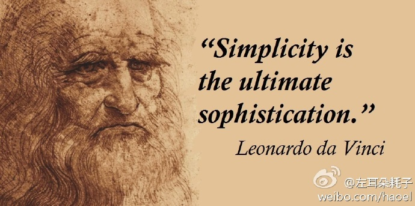
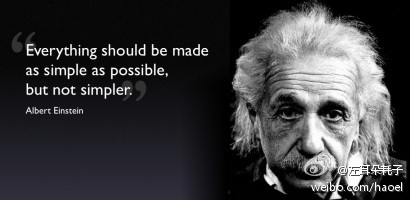

# 简单之道
###  乔布斯

  That’s been one of my mantras—focus and simplicity. Simple can be harder than complex: You have to work hard to get your thinking clean to make it simple. But it’s worth it in the end because once you get there, you can move mountains. 
  
  这一直是我的一个座右铭——集中和简单。简单，可以比实现复杂的东西更难。你必须花很多力气去让你的思维变得简单、有条理。
  
### 达芬奇

Simplicity is the ultimate form of sophistication
简约是复杂的最终形式
 
 
### 爱因斯坦

everything should be made as simple as possible but no simpler

事情应该力求简单，不过不能过于简单
 
  