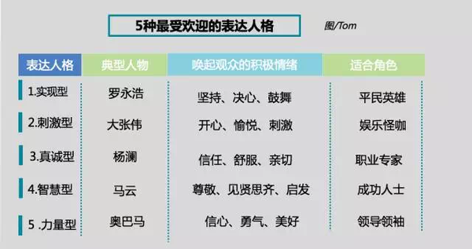

# 如何提高演讲能力？
原文地址:[https://www.zhihu.com/question/19552509](https://www.zhihu.com/question/19552509)
## 回答1 
1. 一个干净利落的开场白至关重要
2. 你讲的所有故事都是为了服务你的观点
3. 来一个“愿景式”的结尾

	李开复在第一集中讲“人工智能”的主题时，结尾同样给了美好的愿景：“在人工智能取代重复性工作后，人类终于重新有时间可以享受人文艺术的美好。”让观众不仅没有因为人工智能时代的到来而感到恐慌，反而有了期待和想象。 	


最后再想聊一下演讲的本质。演讲绝不是朋友间的闲聊，是一种受过训练后的表演。因此只要进行刻意训练，每个人都可以完成一场80分的演讲。但是请永远记住：所有的技巧都代替不了内容和思想本身。——你要表达的观点永远凌驾于所有的技巧之上。


## 问答2
### 演讲本身的技巧
1. 排练！排练超重要的！
2. 控制时间！
3. 准备多个演讲版本：完整的20分钟长版本的、减半的10分钟版本的、超浓缩的3-5分钟版本的……每一页演讲的重要级别都心理有数，这样就能从容面对突发情况，收放自如。  
4. 能脱稿就脱稿
5. 借助手卡。A3卡纸裁8块那种大小拿在手里就挺合适的
6. 准备几个“梗”
7. 准备英文presentation
8. 下发自制补充材料
9. 借助软件同步和录屏
10. 借助放映笔

### 总结与提升的技巧
1. 尝试全程录像
2. 尝试全程录音
3. 请伙伴评价
4. 反思与自评

## 问答3
### 如何写稿子
1.1 选题立意
1.2 头脑风暴论点完成大纲；
1.3 补充论点
1.4 博人眼球
### 练习
 我们首先要明白一个道理，练习的目的不是追求完美，而是为了将内容烂熟于心，以便信手拈来，提升的是自信。我们需要做的只是将稿子熟悉甚至背下，然后站在家中床上面对衣柜，墙壁尽情的宣讲。这样会有两个后果。一个是妈妈认为自己儿子疯了。二个是收获一场漂亮的演讲。
 
 
## 问答4
成功TED演讲的10条法则

1. 展示一个大的想法和愿景. 努力去创造一个你可以呈现的最好的演讲.展示你从前没有展示过的东西,做一些 让观众可以永远记住的,并与他们分享一些可以改变世界的想法.
2. 展示真实的自己.与我们分享您的热情和您的梦想,也包括您的恐惧, 脆弱.谈论成功,也 可以谈谈失败.
3. 把复杂的问题简单化.不要试图炫耀您的智商,也不要把问题说的太抽象,用具体的事例和故事进行讲述.
4. 与观众进行情感链接.让我们大哭也让我们大笑吧!
5. 不要自我吹嘘, 那是最容易被观众轰下台的方法。
6. 此舞台禁止推销!除非我们要求你那样做,否则请勿谈论您的公司或组织,也别期望在舞台上宣传您的产品或者服务,更别说募集资金.
7. 评价,称赞或者挑别的演讲者的刺吧!辩论开始吧!热情的支持是强大的!
8. 请尽量不要用宣读的方式进行演讲. 不过您可以准备一些小的笔记。但假如您只能读稿子或者漫无方向地讲，那还是读稿子吧。
9. 请准时.超时就是在窃取下一位讲者的时间.我们不会允许.
10. 演练您的演讲.在您信任的朋友面前进行试讲,让他帮助您进行计时,准确和清晰度还有 演讲效果.

## 问答5
很简单！学马云！
马云说话是公认的有水平，每次说完都给人一种高山仰止不明觉厉的感觉，贴一篇自己写马云的文章

马云的说话之道可以被拆解为三部分：

1. 否定一个现存的流行观点
2. 提出一个自己的新观点
3. 站在一个更高的层次论证自己的新观点

```
阿里巴巴公司不承诺任何人加入阿里巴巴会升官发财，因为升官发财、股票这些东西都是你自己努力的结果。但是我会承诺你在我们公司一定会很倒霉，很冤枉，干得很好领导还是不喜欢你，这些东西我都能承诺。但是你经历这些后出去一定满怀信心，可以自己创业，可以在任何一家公司做好，你会想:“因为我阿里巴巴都待过，还怕你这样的公司?”
```


## 问答6
据我在创新工场忽悠实习生的经验（曾经有一次把7个实习生里的5个忽悠到一个团队里去），以及我观看过大量乔布斯之外的演讲视频的心得，有几件事儿是比较重要的：

1. 非常非常言之有物，而且，能够持续的给出听众想不到的观点。即使是乔布斯，如果去宣布WindowsVista也会冷场的。
2. 频繁的笑点。郭德纲发布WindowsVista还是会比Ballmer有效果。
3. 把你的听众当朋友而不是主客关系。不是演讲，是交流。即使乔布斯也会问：isn'tcoolhuh?4.一个小技巧：演讲时，可以适度提升语速，甚至在某个阶段把语速提升到平时的两倍，这样会让听众的脑子更快的运转，产生一定的错觉，以为你的演讲真的让他变得更聪明了（特别是在你能做到第一点的情况下），从而让听众获得更大的快感。这方面的高手是MarkAndreessen。


## 问答7
### 表达人格



1. 实现型：这个“实现”，是“自我实现”的意思，这是一个典型的鸡血作用原理。逆袭、从平凡到不凡、从失落到瞩目、从失败到成功… 我们看到的罗永浩、马云、以至于最近的奇葩说里的姜思达，都是这样的典型。 

2. 刺激型:如果你有这样的天赋，一定不要克制， 在一个强调娱乐精神的时代，如果你本来就自带娱乐基因，还有比这更如鱼得水的事吗
3. 真诚型:文质彬彬，应该是对真诚型演讲者的一个最恰当的描述
4. 智慧型：你能够输出强有力的新观念，你就会成为炙手可热的明星。 
5. 力量型：世界上80%的人是没有生活的方向感的，他们被社会既有的规则绑架，被利益集团操纵的主流价值观控制，被统治者们牵着鼻子跑。于是，他们需要一个能麻痹他们的、给他们安全感的一个领袖告诉他们生活究竟是怎样的，世界规则应该是如何运行的，你的人生怎样怎样才是有价值的。这是一段很马基雅维利式的论述。马云有句话讲得很在理的，演讲能带给人力量感不在于会讲话，而在于看问题的角度、深度和广度。 


并不是每个人只拥有一种表达人格，以上5种人格我们都或多或少拥有，只是一个侧重和倾向的程度不同。最好的表达者懂得在不同的场合不同的情景唤醒自己最适合当时的表达人格。

## 问答8
一个好演讲的9个关键内容：
1. HEADLINE 标题
2. PASSION STATEMENT 热情的陈述
3. THREE KEY MESSAGES 三个核心信息
4. METAPHORS AND ANALOGIES 隐喻和类比
5. DEMONSTRATIONS 展示
6. PARTNERS 伙伴
7. CUSTOMER EVIDENCE AND THIRD-PARTY ENDORSEMENTS 用户、第三方真实反馈
8. VIDEO CLIPS 视频
9. FLIP CHARTS, PROPS, AND SHOW-AND-TELL 图标，道具


## 问答9
1.  规避不必要的紧张  
2. 做主场的操控者
3. 不讲项目，讲故事

小技巧

1、观者插话我该怎么办
2、观者的问题我不会回答怎么办？
3、观众全程面无表情（无反馈）怎么办？
4、汇报内容无亮点怎么办？无设计亮点就突出数据特色，无数据特色就体现项目思考。
9


