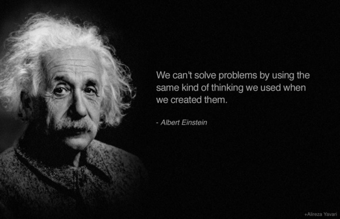

# 我们不能在创造问题的思维层面去思考解决方法
如何理解we can't solve problems by using the same kind of thinking we used when we create them?

我们不能用与制造问题同样的思维来考虑如何去解决问题。- - 爱因思坦

举个例子：
假如我没有钱，我就不能整天想我怎么没钱，而要想想钱是从哪里来的？是不是需要赚钱的能力？赚钱的能力哪里来？

