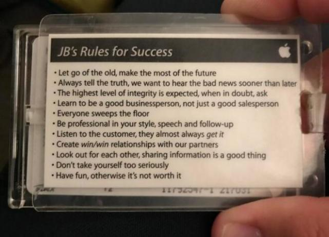

# 早期苹果员工胸牌背面写的11条成功法则

下面是这11条成功法则：

1. 放弃过去，创造未来。
2. 永远讲真话，我们希望尽早地听到坏消息。
3. 实事求是，有疑问就问。
4. 学会做一个好的商人，而不仅仅是一个推销员。
5. 每个人都可以扫地。
6. 着装、谈吐和跟单都必须专业。
7. 聆听消费者的心声，他们几乎总是对的。
8. 与我们的合作伙伴创造双赢的关系。
9. 相互关照，分享信息。
10. 不要把自己太当回事。
11. 在工作中寻找乐趣，不然就不值得。