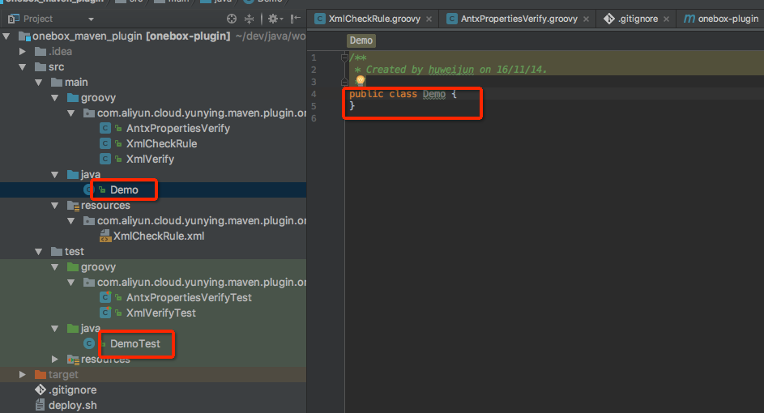

# 设置Groovy的maven编译环境
想要用groovy编写生产和测试代码，需要在编译的过程中执行相应的Groovy编译脚本。这篇文章介绍一下如何在maven中编译Groovy的生产和测试代码。一个标准的java+groovy混用的项目工程结构应用如下

```
main
       --java
       -- groovy
test  
      --java
      --groovy
```
当然偷懒一些也可以省到main/groovy、test/groovy这两个目录，直接把groovy写在main/java和main/groovy里面这样也能work，就是比较乱！

为了让maven能编译Groovy代码(不是IDE)需要借助maven的编译插件，按以下的配置就可以加入maven的groovy编译插件，让maven自动编译groovy！
```
<plugin>
                <artifactId>maven-compiler-plugin</artifactId>
                <version>3.1</version>
                <configuration>
                    <compilerId>groovy-eclipse-compiler</compilerId>
                </configuration>
                <dependencies>
                    <dependency>
                        <groupId>org.codehaus.groovy</groupId>
                        <artifactId>groovy-eclipse-compiler</artifactId>
                        <version>2.8.0-01</version>
                    </dependency>
                    <dependency>
                        <groupId>org.codehaus.groovy</groupId>
                        <artifactId>groovy-eclipse-batch</artifactId>
                        <version>2.4.3-01</version>
                    </dependency>
                </dependencies>
            </plugin>
```

最后是两个比较炕爹的地方
1. groovy的编译插件需要main/java和test/java下面至少存在一个java类才能work。所以在100% groovy的开发的项目里面，就不得不写了一个空的java类来跳过这个炕！

2. gmavenplus-plugin这个groovy的编译插件已经不维护了，需要迁移到本文介绍的方法！

