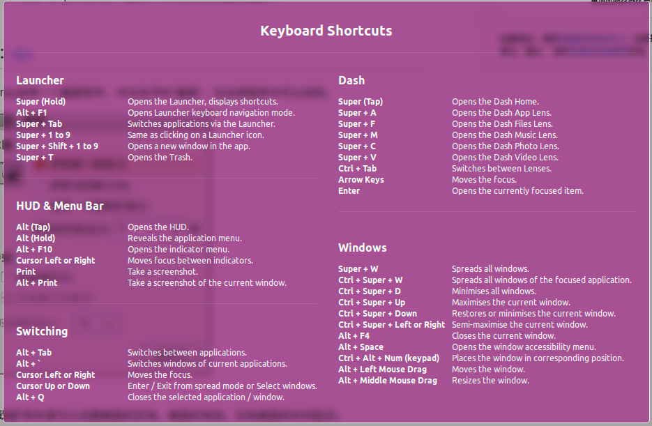

# Ubuntu快捷键

 

### 超级键操作

1. 超级键（Win键）–打开dash。
2. 长按超级键– 启动Launcher。并快捷键列表。
3. 按住超级键，再按1,2,3等数字键–从Launcher打开一个应用程序，当你按住超级键时，每个应用程序图标上都会显示一个数字，按下对应的数字就会打开盖应用程序。
4. 超级键+A–从Launcher打开应用程序窗口。
5. 超级键+F–从launcher打开文件和文件夹窗口。
6. 超级键+M–从launcher打开音乐窗口。
7. 超级键+V–从Launcher打开Vedio视频窗口。
8. 超级键+W–伸展模式，缩小所有工作空间中的窗口。
9. F10–打开顶部面板的第一个菜单，使用箭头键浏览菜单项。
10. 超级键+T–打开回收站。
11. 超级键+S–Expo模式，缩小所有工作空间，允许你管理窗口。
12. Ctrl+Alt+T–启动Terminal。
13. Ctrl+Alt+L– 锁住屏幕。
14. Ctrl+Alt+上/下/左/右键–移动到新的工作空间。
15. Ctrl+Alt+Shift+上/下/左/右键–将窗口放入新的工作空间。

### Ctrl+Super快捷键：

1. Ctrl+Super+Up 键：最大化当前窗口
2. Ctrl+Super+Down键：最小化当前窗口
3. Ctrl+Super+D：最小化所有窗口
4.  Ctrl+Super+Left：半最大化当前窗口（左边）
5. Ctrl+Super+Right：半最大化当前窗口（右边）

### Alt快捷键：

1. Alt+F1 –将键盘焦点移到Launcher上，使用箭头键进行移动，按回车即可启动一个应用程序，按下右箭头键显示Quicklist。
2. Alt+F2 –以特殊模式打开dash，以便运行任何命令。
3. Alt+F10 – 在最大化/非最大化之间切换当前窗口。
4. Alt+F9 – 最小化当前窗口。
5. Alt+Tab – 在当前打开的窗口之间切换。
6. Alt+F4 – 关闭当前窗口。
7. Alt+F7 –移动当前窗口（可以使用键盘或鼠标移动）。

### 参考资料
[Ubuntu 12.04 常用的快捷键](http://blog.csdn.net/xiaojianpitt/article/details/7393058)
