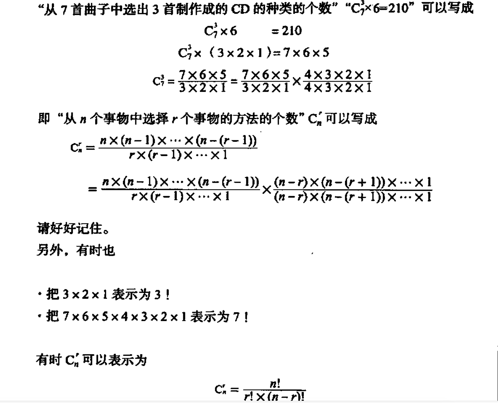
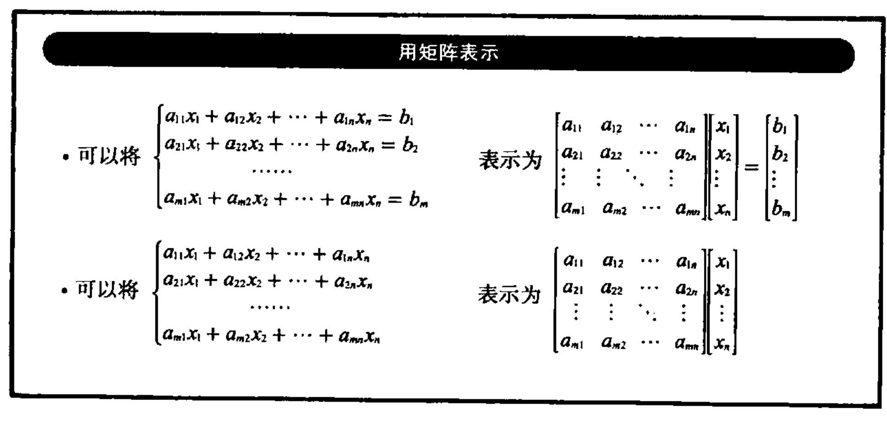
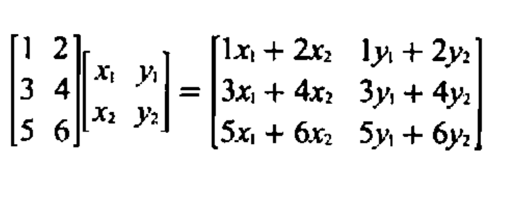
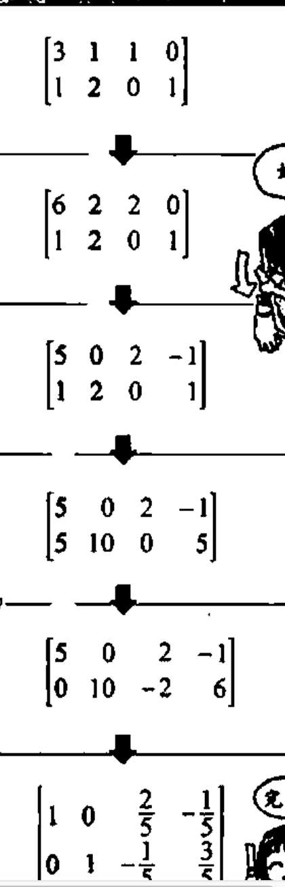
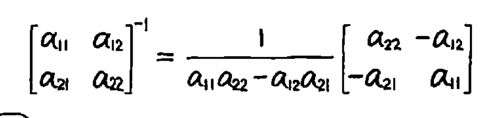
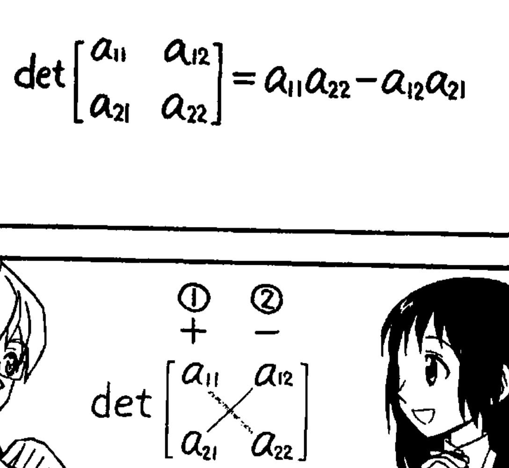
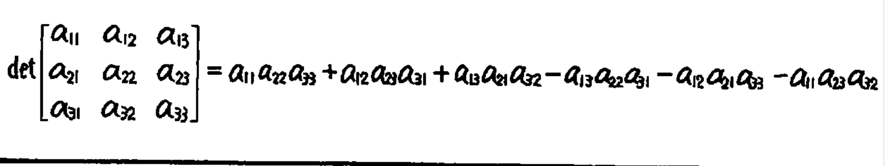

# 线性代数
线性代数就是一门讲m维世界和n维世界联系起来的科学。


## 基础知识
### 数的分类

* 实数
	* 整数
		1. 0
		2. 正整数
		3. 负整数
	* 非整数的有理数
		1. 0.3 这样的的有限小数
		2. 0.3333......这样的循环小数
	* 无理数
		1. 像pi 和2的平方根这样的的无限不循环小数
* 纯虚数


命题：对于因人而异所得出不同判断结果的模糊主张，就不能称之为命题


### 必要和充分条件
如果P成立Q就成立，如果Q成立P就成立，这两个命题都正确的情况。我们就把Q叫做P的充分必要条件，把P叫做Q的充分必要条件。


### 集合
* 当x是集合X的元素时，可以这样表示 x ∈ X 
* 当属于集合X的所有元素都属于集合Y时，可以说集合X是集合Y的子集，可以这样表示 X⊂ Y
* A ⊆ B 表示A是B的子集,即B包含A.但A的元素有可能和B的元素相同,


### 映射
#### 映射
把集合X的元素和集合Y的元素相对应的规则叫做“从集合X到集合Y的映射”。表达方式

```
f:X->Y
```

#### 像
我们把通过映射f与xi对应的集合Y的元素叫xi通过映射f形成的像。一般表示为

```
f(xi)
```

```
f(x)=2x-1
```
这个公式的意思是映射f是集合Y的元素2x-1与集合X的元素x相对应的规则

f(2)的意思是：2通过映射f形成的像是2*2-1

#### 值域和定义域

把由映射f形成的像构成的集合叫做映射f的值域，把集合X叫做映射f的定义域。
值域可以属于集合Y

```
{f(x1),f(x2),f(x3)....,f(xn)}=Y
但一般是
{f(x1),f(x2),f(x3)....,f(xn)}⊂Y

```

### 满射 & 单射 & 满单射
* 当映射f的值域对于集合Y时，就可以说映射f是满射
* 若xi!=xj，则fx！=fy，此时映射就是单射，单射也被称为一对一映射
* 当映射f既是满射也是单射的时候，映射f被称为满单射，又称双射


### 逆映射
当映射f和映射g满足以下两个条件时，就可以说映射g是映射f的逆映射
* g(f(xi))=xi
* f(g(yi))=yi

一般可以这样表示
f-1:X->Y

当映射f对于的逆映射存在 <=> 映射f是满单射

### 线性映射
假设：xi和xj是X的任意两个元素，c为任意实数，f为从X到Y的映射。当映射f满足以下两个条件时，就可以说映射f是从X到Y的线性映射
1. f(xi)+f(xj)=f(xi+xj)
2. cf(xi)=f(cxi)


### 排列组合
* 组合的个数：从n个中选r的个数叫做



* 排列的个数：从n个事物中选r个事物，然后在再将选好的r个事物按照顺序排列的种数


### 矩阵
#### 定义
* 由m行n列数排成的矩阵称为m*n矩阵。
* 矩阵中的数叫元素。
* 行数和列数相等的矩阵称为n阶方阵。
* 方阵对角线上的元素叫对角元素。

用矩阵表示一次方程




#### 矩阵的运算

* 和
* 差
* 倍数:单个数字 * 矩阵
* 积
 
	* 而且左边的矩阵和右边矩阵交换相乘的结果是不一致的
	* 只有当左边矩阵的列数和右边矩阵的行数相等时，两个矩阵才能进行乘法运算
* n阶方阵的p次幂

#### 特殊矩阵
* 零矩阵：所有元素均为0的矩阵
* 转置矩阵：就是将m*n矩阵的行和列交换后得到的
* 对称矩阵：以对角线为中心线对称的n阶方阵。对称矩阵和他的转置矩阵是完全一样的
* 上三角矩阵：所有对角元素左下角的元素都为0的n阶方阵
* 下三角矩阵：所有对角元素右上方的元素都为0的n阶方阵
* 对角矩阵：对角线以外的元素都是0的n阶方阵。***对角矩阵的乘积就是对角数相乘***
* 单位矩阵：对角线元素都是1，对角线以外的元素都是0的n阶方阵。单位矩阵与任何矩阵相乘对原来的矩阵都没有影响


#### 逆矩阵
与n阶方阵X的积等于单位矩阵的n阶方阵就是X的逆矩阵。

* 并非所有的矩阵都存在逆矩阵，我们把存在逆矩阵的n阶方阵叫做可逆矩阵
* 求逆矩阵的方法有代数余子式和消元法。利用代数余子式计算逆矩阵很麻烦。消元法可以用来计算一次方程。
* 消元法是使得接近为单元矩阵的计算方法。
	
* 二阶方阵的简单计算公式，对于3阶以上的还是用消元发比较好。



#### 行列式
* 如果行列式的值不为0，那么该矩阵的逆矩阵就存在。
* 求解行列式的值的方法因n的值的不同而有所不同

***2阶方阵的行列值***



***3阶方阵的行列值***
