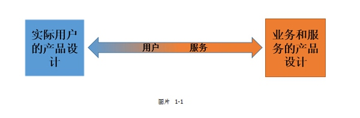

# 【知乎：为什么很多产品经理都不愿意做后台】阅读笔记

## 做后端的产品经理要多少坎 
[原文地址：为什么很多产品经理都不愿意做后台？](https://www.zhihu.com/question/39362334?from=timeline&isappinstalled=0)

### 内部重视不足
1. 很多傻老板以为产品只有前台。
2. 缺乏成就感。具体表现在：做事之前资源少，做事之时决策权小，做事之后由没有合理的评价体系。

### 发挥空间小和业绩关联度不高
1. 很多人对后台产品的预期是能用就行，再加之它属于支持性产品，所以在项目业绩提升的时候，一般人也不会觉得后台在里面发挥了多大的作用。也就是说，做得好，那是你应该的；做得不好，你可能还得背锅。
2. 容易变成被动接受各部门需求的“功能经理”。

### 更新快，迭代多
1. 别看前端产品一会儿一个升级更新，但变动核心功能的情况都是在大版本中。但后台产品不同，每个季度公司业务的发展方向都可能不一样，那么后台就得随时准备跟着更新。就说KPI统计吧，每个季度必然得来这么一遭，上个季度刚刚设定好的指标，费劲心思讨论好如何计算这些指标，花了两、三个礼拜开发好了，这个季度可能分分钟就要下线去计算另外一个指标……所以后台产品经理都有一颗强大的内心，你辛辛苦苦上线的产品很可能马上就被替代，说到拥抱变化，估计后台产品经理最有发言权了吧。

### 难参照竞品
2. 其实也不能说是竞品，而是说可以参照甚至抄袭的对象。面向用户的产品很好调研和分析，毕竟现在是全民创业时代，市面上太多类似的产品。而且一些交互语言是通用的，用户只要大量地使用过别的产品，便会建立起相应的心智模型。然而后台对于很多人而言却非常陌生，毫无心智模型可言，也难以做竞品调研（这样其实非常考验设计的基本功以及设计师的信心）。做后台产品，没有什么可以借鉴的模式。何况做后台还需要非常懂业务。

### 不够好玩，枯燥。
1. 产品团队的考核不尽合理。做前台可以有用户量，收入等指标来说明问题，做后台做好了别人只是觉得“还可以，有些小地方要改进”，做差了得背“严重影响了我们的工作效率”的锅。
2. 你做得再好，后台是能随便脱掉裤子给外边的人看的吗？出去吃个饭都可以发个朋友圈，不能炫耀得是多么无趣。
3. 做过后台的人都知道，其实后台没有那么丰富的交互范式，满屏过去都是各种表格、表单元素和按钮。看着你就觉得枯燥，做的欲望自然已经大大降低。

### 强逻辑，创新难。面对业务、流程相对刻板。
后台不可能是完全孤立的，基本上在做一个功能或业务时，都是先从用户端（前台）出发考虑，而后台只是作为支撑。所以导致后台产品经理需要有强逻辑，但往往本身的创造性体现的比较少。

## 后台产品经理的工作内容
后台主要是管理，主要为5类：产品，事，人，钱，数据：

* 产品本身：产品维护，增删改查。如商品的上下架，活动管理等。此为运营的主要工作之一。
* 事务性：各种内部流程，如审核，商家入住审核，客户的签约审核等等。后台复杂所在。
* 用户管理：对外的客户管理系统（crm），对内的人员架构管理，角色的权限管理，等等。
* 数据分析：收集前台的数据，整合输出，展示分析。运营人员看重此点。
* 考核结算：升降级，销售人员的业绩提成的计算等等。（有业务需求的产品涉及）

1. 后台产品经理，侧重全局，侧重理性，侧重平台支撑（前台产品经理，注重细节,注重感性,注重人内心探索）
2. 后端产品经理需要有业务深入理解的能力、项目管理能力、模块化设计，可拓展性设计能力，还有撕逼的能力

* 平台型产品经理（技术领域）对接开发与测试团队，负责产品架构、产品设计、功能实现；
* 业务型产品经理（商业领域）对接市场与运营团队，负责需求发掘、产品管理、后续运营。

## 前台VS后台

