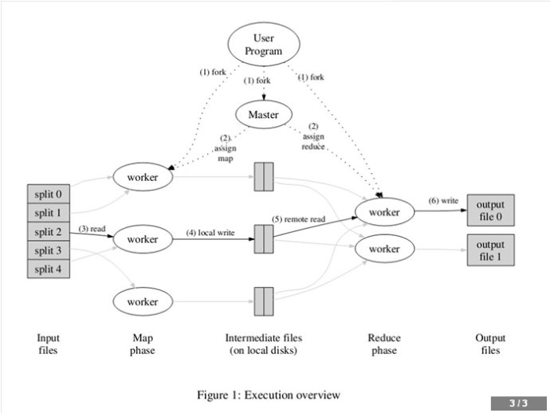

# Map/Reduce原理
原文地址:[http://blog.csdn.net/lifuxiangcaohui/article/details/22675437](http://blog.csdn.net/lifuxiangcaohui/article/details/22675437)

1. MapReduce库先把user program的输入文件划分为M份（M为用户定义），每一份通常有16MB到64MB，如图左方所示分成了split0~4；然后使用fork将用户进程拷贝到集群内其它机器上。 
2. user program的副本中有一个称为master，其余称为worker，master是负责调度的，为空闲worker分配作业（Map作业或者Reduce作业），worker的数量也是可以由用户指定的。 
3. 被分配了Map作业的worker，开始读取对应分片的输入数据，Map作业数量是由M决定的，和split一一对应；Map作业从输入数据中抽取出键值对，每一个键值对都作为参数传递给map函数，map函数产生的中间键值对被缓存在内存中。 
4. 缓存的中间键值对会被定期写入本地磁盘，而且被分为R个区，R的大小是由用户定义的，将来每个区会对应一个Reduce作业；这些中间键值对的位置会被通报给master，master负责将信息转发给Reduce worker。 
5. master通知分配了Reduce作业的worker它负责的分区在什么位置（肯定不止一个地方，每个Map作业产生的中间键值对都可能映射到所有R个不同分区），当Reduce worker把所有它负责的中间键值对都读过来后，先对它们进行排序，使得相同键的键值对聚集在一起。因为不同的键可能会映射到同一个分区也就是同一个Reduce作业（谁让分区少呢），所以排序是必须的。 
6. reduce worker遍历排序后的中间键值对，对于每个唯一的键，都将键与关联的值传递给reduce函数，reduce函数产生的输出会添加到这个分区的输出文件中。 
6. 当所有的Map和Reduce作业都完成了，master唤醒正版的user program，MapReduce函数调用返回user program的代码。 

　　所有执行完毕后，MapReduce输出放在了R个分区的输出文件中（分别对应一个Reduce作业）。用户通常并不需要合并这R个文件，而是将其作为输入交给另一个MapReduce程序处理。整个过程中，输入数据是来自底层分布式文件系统（GFS）的，中间数据是放在本地文件系统的，最终输出数据是写入底层分布式文件系统（GFS）的。而且我们要注意Map/Reduce作业和map/reduce函数的区别：Map作业处理一个输入数据的分片，可能需要调用多次map函数来处理每个输入键值对；Reduce作业处理一个分区的中间键值对，期间要对每个不同的键调用一次reduce函数，Reduce作业最终也对应一个输出文件。
　　