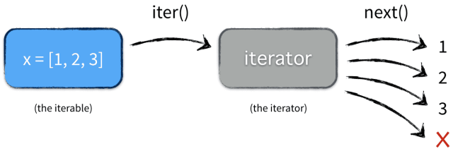

# Python迭代器
## 什么是迭代

1. 可以直接作用于for循环的对象统称为可迭代对象(Iterable)。
2. 可以被next()函数调用并不断返回下一个值的对象称为迭代器(Iterator)。
3. 所有的Iterable均可以通过内置函数iter()来转变为Iterator。

对迭代器来讲，有一个__next()就够了。在你使用for 和 in 语句时，程序就会自动调用即将被处理的对象的迭代器对象，然后使用它的next__()方法，直到监测到一个StopIteration异常。

## Iterator && Interable

1. 内置函数iter()仅仅是调用了对象的\__iter()方法，所以list对象内部一定存在方法iter\__()
2. 内置函数next()仅仅是调用了对象的\__next()方法，所以list对象内部一定不存在方法next\__()，但是Itrator中一定存在这个方法。
3. for循环内部事实上就是先调用iter()把Iterable变成Iterator在进行循环迭代的。
4. Iterator继承自Iterable，从下面的测试中可以很方便的看到Iterator包含\__iter()和next()方法，而Iteratble仅仅包含iter\__()。
5. iterable需要包含有\__iter()方法用来返回iterator，而iterator需要包含有next\__()方法用来被循环

***迭代器的执行***

 
 
### 参考资料
[理解Python的迭代器](http://python.jobbole.com/81916/) 
 