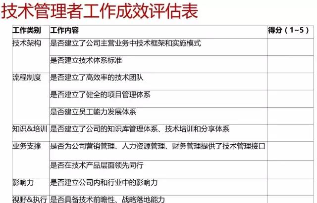
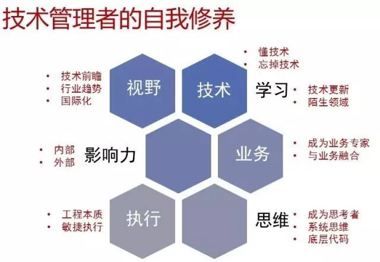

# 转：7个方法快速提升你的技术领导力

### 一、技术

首先要懂技术，最好是程序员出身，并且写过代码，否则你的技术道路会很坎坷，并且一路走来备受质疑，毕竟像阿里巴巴CTO王坚这样的例子，凤毛麟角，不具备普世参考价值。其次，要忘掉技术，站在商业的角度思考技术与业务的融合，为企业创造价值。

## 二、学习

技术领域的发展日新月异，摩尔定律依然适用，需要不断的更新自己的技术知识，帮助企业做出正确的技术布局。另外，要有快速学习业务知识，短时间内成为业务专家的能力，比如：电商、物流、金融、游戏等等领域，可以通过读书、搜索引擎、跟行业专家面对面请教的方式来快速入门，通过实地走访、深度思考，快速领悟行业本质。

### 三、业务

要与业务深度融合，帮助业务人员解决问题，进行头脑风暴，在产品层面领先竞争对手，建立技术壁垒，使技术成为企业的核心竞争力。

### 四、思维

首先，技术领导者要成为思考者，而不是等待执行任务，比如：阻碍业务发展的问题是什么？通过技术手段能不能解决等等。其次，要掌握“系统性思维”方法，但凡复杂的事物，都可以简化成：输入、输出、增速和衰减因子等，理解各变量的相互关系，就不难把复杂问题简单化。再次，要看到事物的底层代码，比如董明珠辞职事件，其本质是职业经理人与资本方矛盾，是自我定位不清晰和过于强势的必然结果。

### 五、执行

作为一名技术领导者要有解决问题的能力，工程师文化的本质是用工程的手段解决商业中的问题，没有借口，而且还要快速的解决，以求在商业竞争中赢得宝贵时间。

### 六、影响力

影响力的建立不是一朝一夕的，但是在实际工作中要尽量快速的建立起影响力，比如帮助下属解决一个技术问题、引进行业技术牛人来公司指导、到行业论坛去做分享等等，都是快速建立起影响力的方法。

### 七、视野

要多留意技术和行业的发展趋势，多参与行业合作和交流，多研究国外同行的领先做法，开阔自己的视野，保持所在企业的技术布局领先，甚至超越同行。