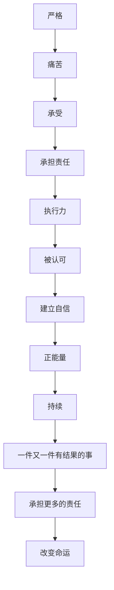

# 严格是大爱

```mermaid

graph TD;
  严格-->痛苦;
  痛苦-->承受;
  承受-->承担责任;
  承担责任-->执行力;
  执行力-->被认可;
  被认可-->建立自信;
  建立自信-->正能量;
  正能量-->持续;
  持续-->一件又一件有结果的事;
  一件又一件有结果的事-->承担更多的责任;
  承担更多的责任-->改变命运;

```

### 总结

No pains No gains 没有付出就没有收获;不用害怕和担心那些承担不了挑战和压力的人，既然不能承担挑战和压力，自然就会被淘汰，只是早晚的问题，越早对团队越有利！
