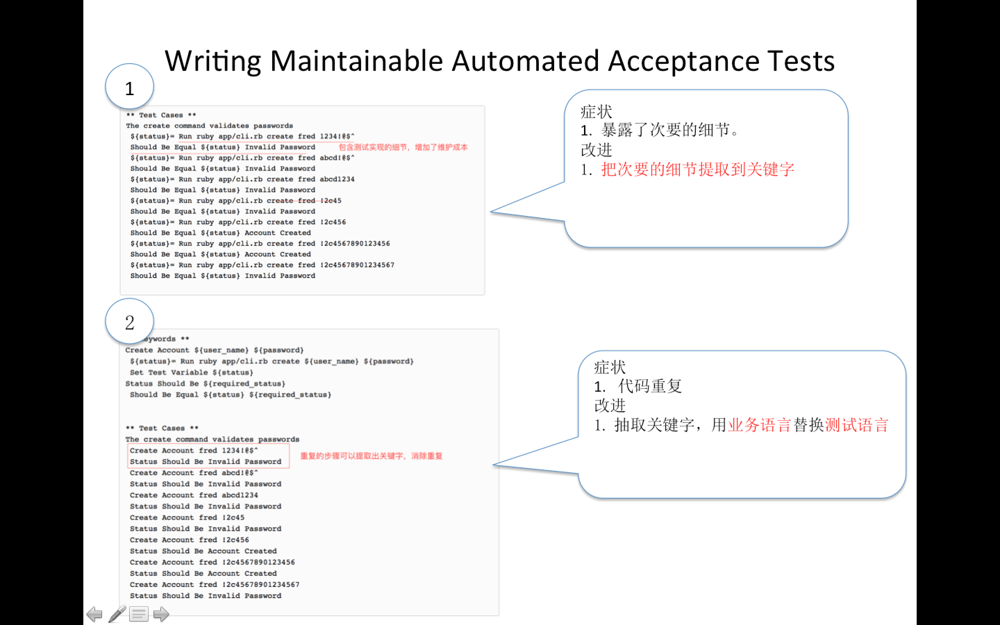
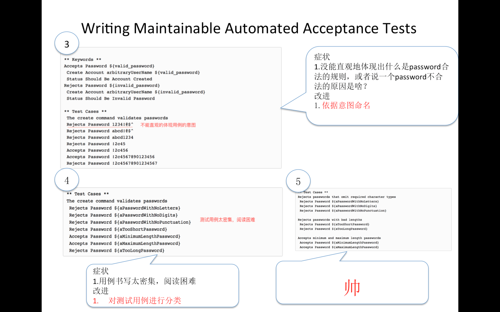

# 翻译：编写可维护的自动化验收测试
原文：[http://cwd.dhemery.com/2009/11/wmaat/](http://cwd.dhemery.com/2009/11/wmaat/)


## 核心观点

* Hiding incidental details——隐藏次要的细节
* Eliminating duplication——消除重复
* Naming essential ideas——依据依据命名


## 正文如下

### 测试自动化是软件开发
测试自动化是软件开发。这条原则意味着我们对软件开发方面的认知也适用于自动化测试。

软件开发的很大一部分成本是维护。在成功的和不成功的自动化测试努力，这个是一个很重要的因素。很多人放弃自动化测试很重要的一个原因是测试用例易碎和需要大量的维护。系统实现的小改动就可能会要对一堆的测试用例进行调整。

对比一些在自动化测试方面做的成功的组织，成功的组织意识到自动化测试就是软件开发，就需要投入维护成本，另一方面需要努力的去降低测试的维护成本。
修改测试的来源有两个：需求的改变和系统实现的改变。有两个因素导致Code难以改变：代码重复和次要的细节


验收测试用于审查系统是不是正确实现了特定的功能。所以验收测试本质是审查，而无关于实现测试的细节。


举例来说：创建账号的时候需要校验password的安全等级。这点是职责的本质，而非系统的实现方式（web app或者GUI APP）


```
** Test Cases **
The create command validates passwords
 ${status}= Run ruby app/cli.rb create fred 1234!@$^
 Should Be Equal ${status} Invalid Password
 ${status}= Run ruby app/cli.rb create fred abcd!@$^
 Should Be Equal ${status} Invalid Password
 ${status}= Run ruby app/cli.rb create fred abcd1234
 Should Be Equal ${status} Invalid Password
 ${status}= Run ruby app/cli.rb create fred !2c45
 Should Be Equal ${status} Invalid Password
 ${status}= Run ruby app/cli.rb create fred !2c456
 Should Be Equal ${status} Account Created
 ${status}= Run ruby app/cli.rb create fred !2c4567890123456
 Should Be Equal ${status} Account Created
 ${status}= Run ruby app/cli.rb create fred !2c45678901234567
 Should Be Equal ${status} Invalid Password
 
```

这个测试用例没能体现出password和状态之间的关系，也就没有体现出核心的职责，但有非常多的Incidental Details。Incidental Details破坏了可维护性。如果需求改变，例如增加字符串的长度。从测试用例来看，是还是无法确定需求改变的时候，测试用例需要如何调整。Incidental Details增加了我们的维护成本。而Incidental Details源自我们实现系统和测试的方式和方法。

调整以后的Test Case

```
** Keywords **
Create Account ${user_name} ${password}
 ${status}= Run ruby app/cli.rb create ${user_name} ${password}
 Set Test Variable ${status}
Status Should Be ${required_status}
 Should Be Equal ${status} ${required_status}
 
 
** Test Cases **
The create command validates passwords
 Create Account fred 1234!@$^
 Status Should Be Invalid Password
 Create Account fred abcd!@$^
 Status Should Be Invalid Password
 Create Account fred abcd1234
 Status Should Be Invalid Password
 Create Account fred !2c45
 Status Should Be Invalid Password
 Create Account fred !2c456
 Status Should Be Account Created
 Create Account fred !2c4567890123456
 Status Should Be Account Created
 Create Account fred !2c45678901234567
 Status Should Be Invalid Password
 
```

通过把一些 incidental details 提取成关键字，让测试用例容易理解和维护。

另外，验收测试中可以把测试语言转换业务语言。 

上面这个例子中，重复了创建账号和系统反馈的状态。重新定义了新的关键字。

```

** Keywords **
Accepts Password ${valid_password}
 Create Account arbitraryUserName ${valid_password}
 Status Should Be Account Created
Rejects Password ${invalid_password}
 Create Account arbitraryUserName ${invalid_password}
 Status Should Be Invalid Password
 
** Test Cases **
 The create command validates passwords
 Rejects Password 1234!@$^
 Rejects Password abcd!@$^
 Rejects Password abcd1234
 Rejects Password !2c45
 Accepts Password !2c456
 Accepts Password !2c4567890123456
 Rejects Password !2c45678901234567
```


### Naming the Essence
上面这个测试用例，并没有直观地体现出为什么是password合法的规则，或者说一个password不合法的原因是啥？对测试用例含义的困惑都会导致维护成本的上升！举例来说：1234!@$^ 没能直观的体现出这个password里面缺少了必要的字母。


```
** Test Cases **
The create command validates passwords
 Rejects Password ${aPasswordWithNoLetters}
 Rejects Password ${aPasswordWithNoDigits}
 Rejects Password ${aPasswordWithNoPunctuation}
 Rejects Password ${aTooShortPassword}
 Accepts Password ${aMinimumLengthPassword}
 Accepts Password ${aMaximumLengthPassword}
 Rejects Password ${aTooLongPassword}

```

再把测试用例分成几段，每一段验证相似的逻辑。


```
** Test Cases **
Rejects passwords that omit required character types
 Rejects Password ${aPasswordWithNoLetters}
 Rejects Password ${aPasswordWithNoDigits}
 Rejects Password ${aPasswordWithNoPunctuation}
 
Rejects passwords with bad lengths
 Rejects Password ${aTooShortPassword}
 Rejects Password ${aTooLongPassword}
 
Accepts minimum and maximum length passwords
 Accepts Password ${aMinimumLengthPassword}
 Accepts Password ${aMaximumLengthPassword}

```



	