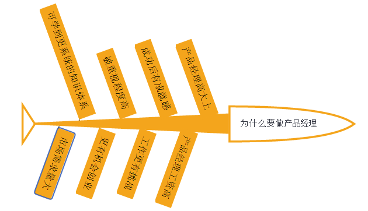
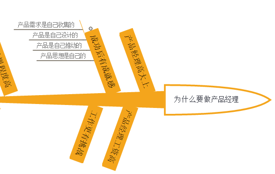
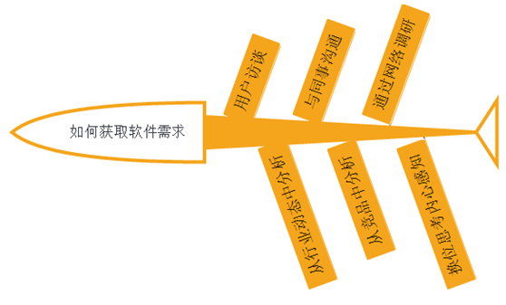

# 鱼骨图
原文地址[http://www.woshipm.com/pmd/352271.html](http://www.woshipm.com/pmd/352271.html)

## 鱼骨图使用场景？
鱼骨图分三种类型：原因型、对策型、整理问题型。

### 原因型
原因型。用来分析构成问题的原因，鱼头代表结果，一般用“为什么……”开头，如：“为什么项目会失败”、“为什么项目费用超预算”、“为什么公司氛围这么差”等等。这种类型的鱼骨图是通过已知结果来分析形成此结果的原因，经过头脑风暴找出形成答案。原因型鱼骨图鱼头一般在右侧，原因在左侧。

 

### 对策型
对策型。对策型鱼骨图要找的是问题的对策，多用“如何……”开头，如：“如何才能实现年入百万”、“如何才能加入理想的公司”、“如何才能做出好产品”。对策型鱼骨图鱼头一般在左侧，对策在右侧。鱼头为问题结果，分析内容为实现结果的方法。

 
 
 
### 整理问题型
此种类型鱼骨图鱼头与各分支间没有原因关系，而是用图形的方式来整理问题的结构。这里的结构指的是对象的层级，如同书的目录、网站的结构图等。鱼头为结果，鱼骨上的结点为此结果的结构项。

