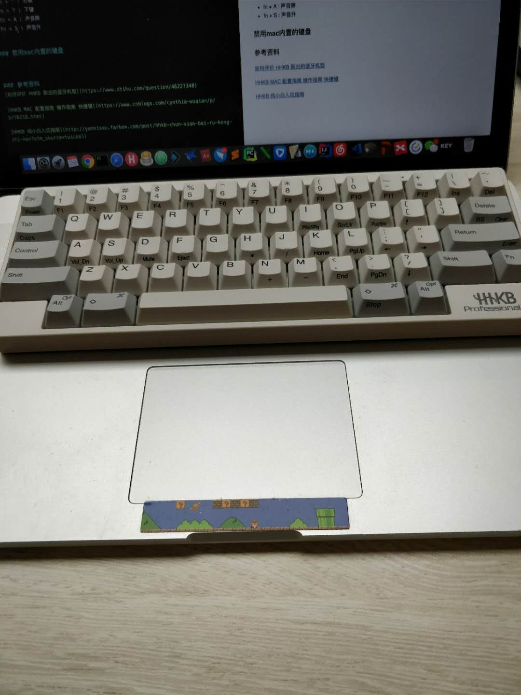
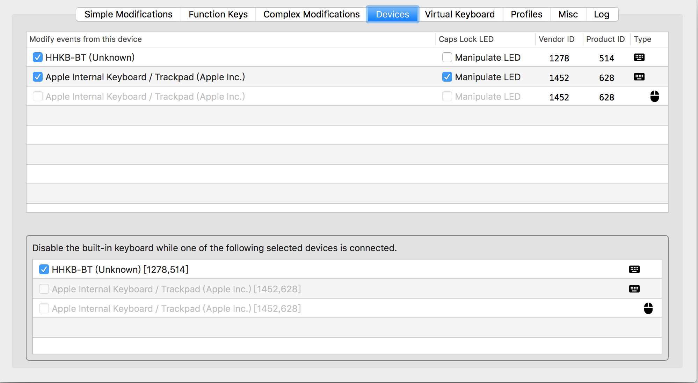
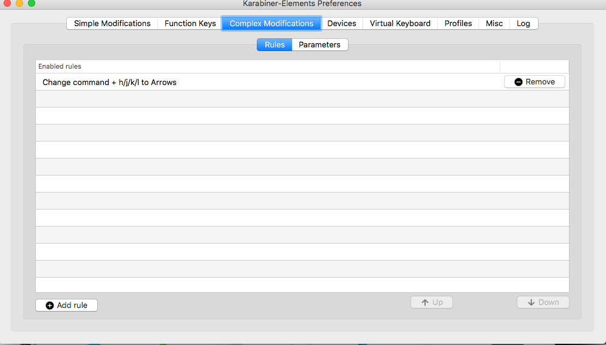

# HHKB键盘设置

### MAC环境键盘配置
* 调节hhkb的模式为Macintosh模式：011001 

### hhkb组合键
* 切换程序：cmd + tab  
* 打开新程序：control + 空格 (如果安装了帽子的同学，可以alt+空格)
* fn + tab :  切换大小写
* cmd +  空格 ：切换输入法
* fn + O : 光线变暗
* fn + P :光线变亮
* fn + [ : 上键
* fn + " : 右键
* fn + ? : 下键
* fn + A : 声音降
* fn + S : 声音升
           

### 禁用mac内置的键盘
   
如果你想把HHKB放置到Mac 笔记本的内置键盘区就需要禁用掉Mac的内置键盘。通过Karabiner能很方便的支持这个，Karabiner检测到HHKB连上Mac以后可以自动的禁止Mac的内置键盘。

### 设置方向键
HHKB在Mac OS需要用小拇指 FN ＋ [;'/ 实现方向键。Fn和[;'/在一个手上操作太麻烦!

通过Karabiner可以实现Command+ HJKL替换方向键

        

### 参考资料
[如何评价 HHKB 新出的蓝牙机型](https://www.zhihu.com/question/46227340)

[HHKB MAC 配置指南 操作指南 快捷键](https://www.cnblogs.com/cynthia-wuqian/p/5778218.html)

[HHKB 纯小白入坑指南](http://yannisxu.farbox.com/post/hhkb-chun-xiao-bai-ru-keng-zhi-nan?utm_source=tuicool)