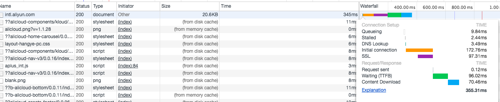
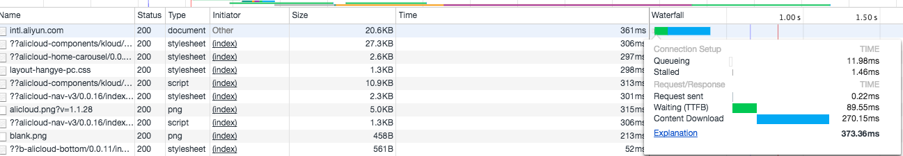

# HTTP KEEP-ALIVE优化

### 短连接与长连接
通俗来讲，浏览器和服务器每进行一次通信，就建立一次连接，任务结束就中断连接，即短连接。相反地，假如通信结束（如完成了某个HTML文件的信息获取）后保持连接则为长连接。在HTTP/1.0中，默认使用短连接。从HTTP/1.1起，默认使用长连接，这样做的优点是显而易见的，一个网页的加载可能需要HTML文件和多个CSS或者JS，假如每获取一个静态文件都建立一次连接，那么就太浪费时间了，而在保持连接的情况下，继续GET即可。
对于频繁请求资源的客户来说，较适用长连接。但连接数最好进行限制，防止建立太多连接拖累服务端。一般浏览器对一个网站的连接是有限制的几个，所以网站会将资源部署在多个域名上以实现浏览器同时请求。
短/长连接应当在TCP连接的范畴中来讨论。有人常说HTTP的短连接和长连接如何如何，但是HTTP只是一个应用层协议，又是无状态的，最终实质性的保持连接还是得靠传输层，即TCP。
举个例子，NginX作为代理的一种常见配置方式是在NginX与客户端之间的连接使用长连接，NginX与后端服务器之间的连接使用短连接

以当nginx设置了keepalive等待下一次的请求时，同时也会设置一个最大等待时间，这个时间是通过选项keepalive_timeout来配置的，如果配置为0，则表示关掉keepalive，此时，http版本无论是1.1还是1.0，客户端的connection不管是close还是keepalive，都会强制为close。

图一和图二明显的差别就是第二次intl.aliyun.com的链接过程中没有了建立链接的步骤。

### HTTP的KEEP-ALIVE
合理的keep-alive timeout值5-10秒。

### HTTPS的KEEP-ALIVE
1. https的连接如果保持keep-alive可以显著提升性能。因为可以减少ssl握手。
2. 如果ssl session不能集群共享，由于load balance的存在，要么load blanace要提供SSL sticky或者 Session Affinity

### 参考资料
[IBM HTTP Server Performance Tuning](http://publib.boulder.ibm.com/httpserv/ihsdiag/ihs_performance.html)

[短连接、长连接与keep-alive](http://xsk.tehon.org/den/index.php/category/tech/short-or-long-tcp-connection-and-keepalive.html)

[HTTP协议Keep-Alive模式详解和HTTP头字段总结](https://www.kafan.cn/edu/5110681.html)